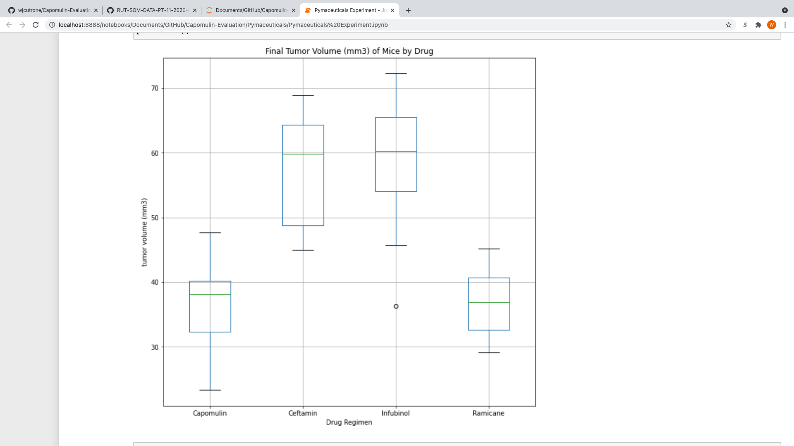
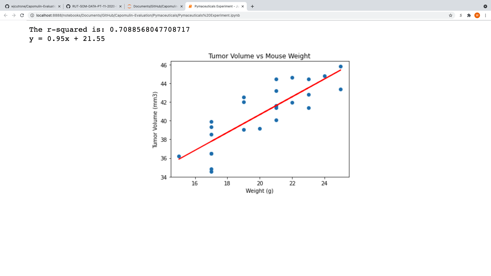
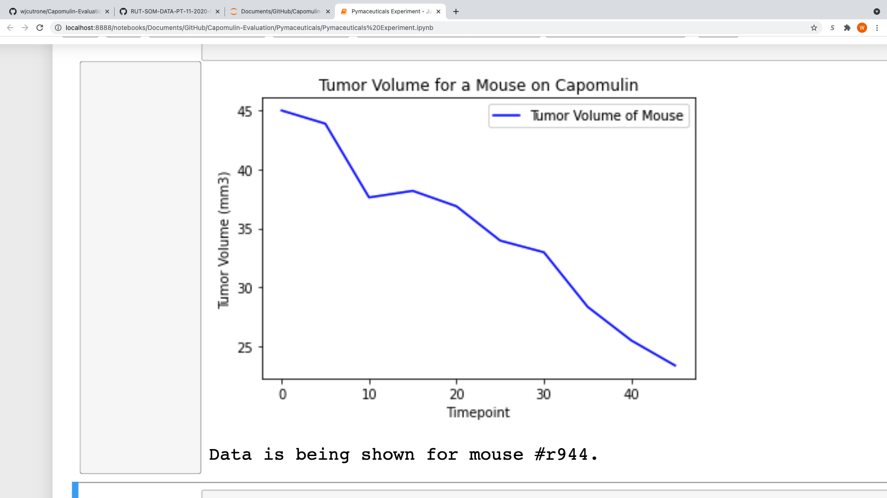

# Capomulin Evaluation

Purpose:
The objective of this repository was to evaluate the performance of a company's drug of interest called Capomulin by comparing it to other treatment regimens. 

Analysis:
Of the four drug regimens that were asked to be examined, Capomulin and Ramicane were the most effective. These drugs were far more effective than Infubinol or Ceftamin. However, one cannot definitively conclude if Capomulin or Ramicane is a more effective drug compared to the other. Capomulin and Ramicane both have very close median tumor volumes at the final timepoint of the experiment(38 and 36 mm3 respectively). The upper and lower quartiles for tumor volume at the final timepoint are both 32 and 40 mm3 for both drugs as well. Therefore, both drugs produced almost the same results, and it cannot really be argued that one is more effective than the other. However both are still far more effective than Infubinol or Ceftamin, as both of these drugs at median tumor volumes of around 60 mm3. Below is a boxplot showing each of the four drugs' effects on tumor volume, as you can see, Capomulin and Ramicane produce the lowest tumor volumes.

Another trend I noticed from the data is that there is a fairly strong correlation between weight of the mice and tumor volume. You can see from the scatter plot that the data closely resembles that of a linear relationship. In addition to the appearance of the plot, there are also statistical values that back this claim up as well. One of these values is the correlation coefficient of 0.84. The correlation coefficient measures the strength of the relationship between two variables, and the maximum value for this measurement is 1. Therefore, a value of 0.84 would suggest a fairly strong correlation. Another similar value that backs this up is the r-squared value, which represents how close the relationship between variables match the regression line. In this case, the value is 0.71, which shows that the relationship between the variables is strong. Lastly, the slope of the regression line also indicates a strong relationship between the variables as well. The slope of the regression line is 0.95, which is pretty close to a slope of one, which would indicate a perfect linear relationship.

Lastly, I would be willing to claim that Capomulin was overall a very effective drug for many mice in the experiment in terms of reducing tumor volume. In the graph that shows the tumor volume decrease over time for a single mouse on Capomulin, I frequently have noticed that there is a steep decline in tumor volume over the time. I ran the graph many times for many random mice in the table. Almost all of them depict the same line graph. A steep line with a negative slope high in magnitude. For almost all the random simulations run for various mice, the graph almost every times shows a decrease in tumor volume of about 50%. Very often, these mice are starting with a tumor volume of about 45 at the first time point and finishing with a tumor volume of about 20-25. Therefore, I am willing to firmly back the claim that Capomulin is a very effective drug in regards to decreasing tumor volume in mice. Hopefully, we will see the same trends when applied to humans.

